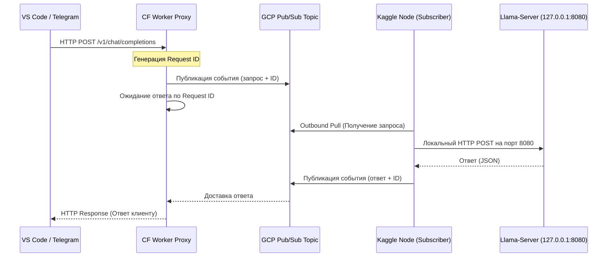

# Анализ: Использование Google Cloud Pub/Sub / Cloudflare Tunnels вместо Ngrok

В данном исследовании рассматриваются два альтернативных подхода к проксированию трафика на Kaggle-серверы:
1. **Google Cloud Pub/Sub** (Асинхронная очередь сообщений).
2. **Cloudflare Tunnel (Argo)** (Постоянные публичные туннели).

---

## Вариант 1: Google Cloud Pub/Sub (Асинхронное проксирование)

При использовании Google Cloud Pub/Sub вместо стандартного HTTP-туннеля (Ngrok) схема взаимодействия полностью меняется со стандартной клиент-серверной архитектуры на **событийно-ориентированную (Event-Driven)**.

### Архитектура решения

### Преимущества
* **100% Исходящий трафик (Outbound-only)**: Kaggle-ноде вообще не требуются входящие порты. Она сама делает исходящие HTTPS-запросы к Google API для опроса очереди (Pull). Это на 100% легально в рамках политик Kaggle и никогда не вызовет блокировку сессии.
* **Игнорирование сетевых экранов**: Облачные IP-адреса Google API уже добавлены в белые списки Kaggle, что гарантирует максимальную стабильность соединения.
* **Упрощенная ротация (Implicit Routing)**: Отпадает необходимость в регистрации новых URL-ов в KV-базе Cloudflare. Обе ноды (A и B) могут быть подписаны на одну и ту же очередь `requests-topic`. Как только нода B запускается, она просто начинает забирать сообщения из очереди, а нода A отписывается перед выключением.

### Недостатки
* **Задержка (Latency)**: Очередь добавляет оверхед на сериализацию и передачу сообщений через брокер. Задержка на каждый запрос возрастет на **150–350 мс**.
* **Сложность стриминга (Streaming / SSE)**: `llama-server` возвращает текст чанкам (Server-Sent Events). Передача потокового текста через Pub/Sub требует разбиения ответа на множество мелких сообщений с сортировкой по индексу, что сильно усложняет код прокси-сервера.

---

## Вариант 2: Cloudflare Tunnels (Public Tunnel / Argo)

Cloudflare Tunnels (утилита `cloudflared`) — это прямой аналог Ngrok, но работающий в экосистеме Cloudflare. Он уже поддерживается в нашем проекте (в файле **[scripts/tunnel.py](file:///d:/123VsakayaVsyachina/___LAB/AI_WEB/_RestrictAI/Kaggle/KeglaAI/kaggle-llm-server/scripts/tunnel.py)**).

### Сравнение с Ngrok

| Параметр | Ngrok | Cloudflare Tunnel |
| :--- | :--- | :--- |
| **Стоимость** | Бесплатный лимит ограничен 1 туннелем и динамическим адресом. Постоянный домен дается только один на аккаунт. | 100% бесплатно без ограничений на количество туннелей или портов. |
| **Постоянный адрес** | Требует ручной привязки домена `ngrok-free.dev`. | Привязывается к вашему собственному домену (например, `api.my-site.com`), делегированному на Cloudflare. URL не меняется при ротации. |
| **Лимиты трафика** | Ограничение по количеству соединений в минуту на бесплатном тарифе. | Нет лимитов на трафик и количество одновременных соединений. |
| **Авторизация** | Требует токен `NGROK_AUTHTOKEN`. | Требует токен туннеля `CLOUDFLARE_TUNNEL_TOKEN`. |

---

## Резюме и рекомендации

1. **Если критически важна простота и поддержка стриминга (SSE)**:
   Идеальным решением является использование **Cloudflare Tunnels** с привязкой к собственному домену. Мы уже заложили эту поддержку в `start.py` и `tunnel.py`. Вам достаточно указать секреты `CLOUDFLARE_TUNNEL_TOKEN` и `CLOUDFLARE_DOMAIN` в настройках Kaggle.
   
2. **Если Kaggle начнет блокировать бинарники туннелей (`ngrok`, `cloudflared`)**:
   Переход на **GCP Pub/Sub** станет единственным способом сохранить работоспособность. Это потребует написания легковесного Python-скрипта адаптера внутри Kaggle (опрашивающего queue и пересылающего запросы на localhost) и обновления логики Cloudflare Worker для работы с очередями Pub/Sub.
