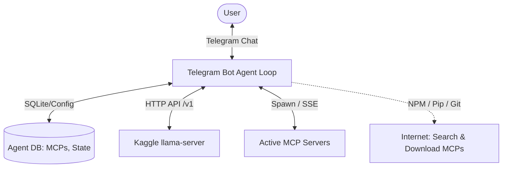
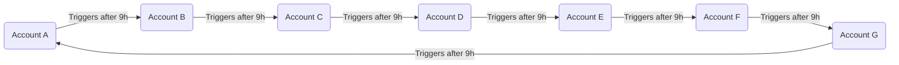
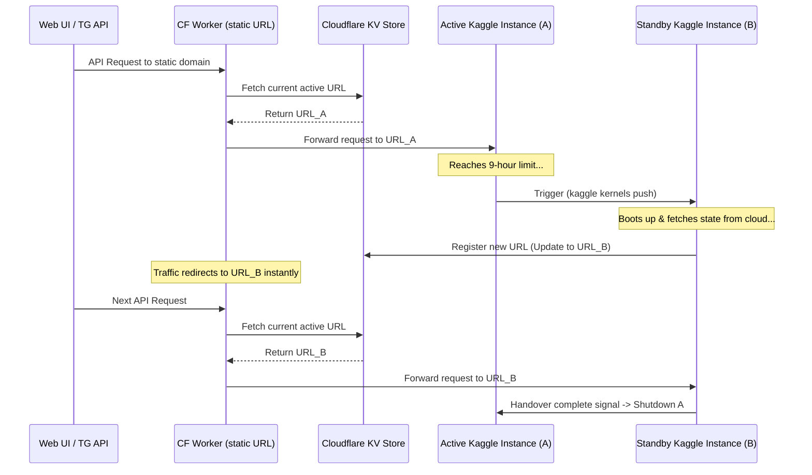
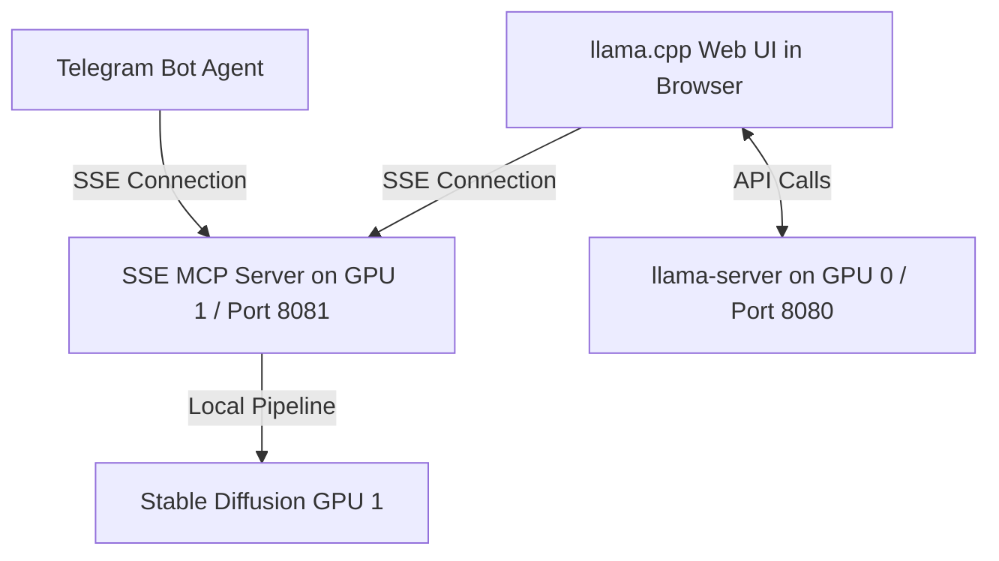

# Research & Implementation Plan: Dynamic MCP Telegram Agent & 24/7 Kaggle Failover

This document outlines the research, system architecture, and step-by-step implementation plans for:
1. Running a 27B model on Tesla T4 GPUs.
2. A Telegram Bot Agent Loop that dynamically searches, installs, and manages Model Context Protocol (MCP) servers and tools.
3. A Blue-Green 24/7 seamless failover deployment orchestrator across multiple Kaggle accounts.
4. Exposing and integrating image and video generation models on GPU 1 with the text model on GPU 0.

---

## Part 1: Model Analysis (XORTRON 27B)

### 1. Model Specifications
- **Model A**: `darkc0de/XORTRON.CriminalComputing.2026.27B.Instruct.NEXT` (Unquantized FP16, ~54 GB)
- **Model B**: `iiiTRONiii/XORTRON.CriminalComputing.2026.27B.Instruct.NEXT-Q6_K-GGUF` (Quantized Q6_K, ~21.6 GB)

### 2. Feasibility of Self-Quantizing Model A on Kaggle
Local quantization of a 27B model inside a Kaggle Container is **practically impossible** due to the following hard limits:
1. **Disk Space Limit**: Kaggle allocates a maximum of 20 GB in `/kaggle/working`. Downloading the unquantized FP16 version requires ~54 GB of disk space. Even utilizing temporary directories (`/tmp`), there is insufficient disk IO throughput and space to write both the input FP16 files and output GGUF files simultaneously.
2. **RAM Limit**: Quantizing a 27B model from scratch requires loading the FP16 weights into RAM. Kaggle provides 30 GB of system RAM, which will cause an immediate Out of Memory (OOM) crash during the conversion phase.
3. **Time Limits**: Moving 54 GB from Hugging Face and quantizing it on 2 CPU cores would take several hours, risking session timeouts.

### 3. Running Model B (Q6_K) on T4 GPUs
- **Size**: ~21.6 GB.
- **Single T4 GPU (16 GB)**: Will **not** fit. If loaded on one GPU, it will offload ~8 GB of layers to the CPU, dropping performance to a crawl (<1.5 tokens/sec).
- **Dual T4 GPUs (32 GB total VRAM)**: Fits **perfectly**. 
  - Our `optimize.py` script will automatically detect both GPUs and compute a split (e.g., `tensor_split: "0.5,0.5"`).
  - This allocates ~11 GB of model weights on GPU 0 and ~11 GB on GPU 1, leaving ~4-5 GB of VRAM free on each card for a large, fast 32k-64k context window.
- **Recommendation**: **Use the pre-made GGUF `Q6_K` model from `iiiTRONiii`**. Skip local quantization.

---

## Part 2: Telegram Bot Agent Loop with Dynamic MCPs

### 1. System Architecture


To enable dynamic tool calling (Web Search, custom MCPs) over a stateless API, the **Telegram Bot itself must act as the Agent Loop (Orchestrator)**. The LLM engine (`llama-server`) acts purely as the brain, returning tool calls when requested.

### 2. Research: Dynamic MCP Loading
- **How it works**: The Telegram Bot agent runs an MCP Client. When it starts a chat completion request, it compiles a list of all active tools from its connected MCP servers and sends them to `llama-server`.
- **Dynamic Installation**: We can equip the LLM with system tools:
  - `search_mcp_registry(query)`: Searches community repositories or npm/pip for MCP packages.
  - `install_mcp_server(name, type, config)`: Runs installation commands (e.g., `npm install -g`, `pip install`, or clones a git repo) and writes the new configuration block to a local SQLite database.
  - `reload_mcp_servers()`: Spawns the new server process and connects its tool schemas to the active list.

### 3. Telegram Commands Interface
- `/mcp_list`: Lists all installed MCP servers, showing their Status (Active/Disabled) and the list of exposed tools.
- `/mcp_enable <name>`: Enables a server.
- `/mcp_disable <name>`: Disables a server (terminates the background process).
- `/mcp_add <config_json>`: Manually registers a custom MCP server.
- `/mcp_search <query>`: Searches for available tools.

### 4. Implementation Steps
1. **Agent Engine Core**: Build a Python-based Telegram bot using `python-telegram-bot` and `mcp-python-sdk`.
2. **Local Database**: Initialize an SQLite database to store:
   - Registered MCP configurations (command, env, args).
   - Tool execution permissions.
   - Persistent user chat history.
3. **LLM Function Calling Binding**: Implement the tool-execution loop. If the LLM response contains `tool_calls`, the bot intercepts them, executes the corresponding MCP tool locally, feeds the result back to the LLM, and repeats until the final response is ready.
4. **Dynamic Installer Module**: Write sandboxed installation scripts to safely pull and spin up new Node.js/Python MCP processes.

---

## Part 3: 24/7 Seamless Kaggle Failover System (9-Hour Rotation)

Kaggle limits individual sessions to 12 hours and caps weekly GPU usage at 30 hours per account. To operate 24/7, we must configure a cyclic rotation schedule using multiple accounts.

### 1. Mathematical Feasibility
- **Total weekly hours**: 168 hours.
- **Run duration per account session**: 9 hours.
- **Limit per account**: 30 hours/week.
- **Weekly runs per account**: 3 runs.
- **Total active hours per account per week**: `3 runs * 9 hours = 27 hours`.
  - This leaves a **3-hour safety buffer** per account every week (safely below the 30-hour limit).
- **Minimum number of accounts needed**:
  - `168 hours (weekly total) / 27 hours (per account limit) = 6.22 accounts`.
  - Rounding up to the nearest integer, we need **exactly 7 accounts** to achieve 100% uptime:
    `7 accounts * 27 hours = 189 hours` of total weekly capacity (offering an extra 21 hours of headroom).

### 2. Account Ring Topology
The accounts are linked in a directed ring graph. Each instance is responsible for triggering the next account in the chain:



- **Credentials Storage**: To maintain security, each account only needs to store the Kaggle API configuration (`kaggle.json`) of the **next** account in the ring.
  - Account A stores Secret `NEXT_KAGGLE_CONFIG` containing the API JSON key of Account B.
  - Account B stores Secret `NEXT_KAGGLE_CONFIG` containing the API JSON key of Account C.
  - ... and so on.

---

## Part 4: Technical Failover Implementation Details

### 1. State Synchronization (Yandex Disk / Google Drive)
Because Kaggle containers are completely wiped when stopped, the active state (SQLite database, Telegram chat history, active MCP configurations) must be preserved during handover.
- **Cloud Storage**: A shared Google Drive folder or a Yandex Disk directory accessed via WebDAV/Rclone.
- **Pre-handover step**: Just before Account A triggers Account B, it encrypts and uploads the current sqlite database (`agent.db`) and custom configurations to the cloud storage:
  `rclone copy ./data/agent.db gdrive:/sync/`
- **Boot step**: When Account B launches, the very first step in its startup script is to download the latest state file:
  `rclone copy gdrive:/sync/agent.db ./data/`
  This ensures no conversation logs or active settings are lost during the transition.

### 2. Proxy Routing System (Cloudflare Worker)
To prevent the client (VS Code, Web UI, Telegram API) from needing to update their URLs every 9 hours, we run a lightweight proxy router that acts as the single public entrypoint:



- **Proxy Engine**: A free Cloudflare Worker. It reads incoming requests and routes them using the `fetch()` API to the target address stored in **Cloudflare KV**.
- **Latency**: Cloudflare KV writes take under 10 seconds to propagate worldwide, resulting in a practically instantaneous, zero-downtime routing swap.

### 3. Step-by-Step Handover Protocol
1. **Heartbeat Loop**: The Python orchestrator on Account A runs a timer thread.
2. **Launch Trigger (T + 8h 50m)**:
   - Account A retrieves `NEXT_KAGGLE_CONFIG` from Kaggle secrets.
   - It writes the credentials to `~/.kaggle/kaggle.json`.
   - It triggers Account B's notebook via the CLI:
     ```bash
     kaggle kernels push -p ./standby_notebook_metadata/
     ```
3. **Standby Boot (T + 8h 52m)**:
   - Account B starts up.
   - It syncs the database from Yandex Disk / Google Drive.
   - It boots `llama-server` and establishes its tunnel connection.
4. **Proxy Registration (T + 8h 55m)**:
   - Account B performs a local `/health` check. Once healthy, it sends an authenticated HTTP request to the Cloudflare Worker:
     ```bash
     curl -X POST https://proxy.mydomain.com/register -d '{"url": "https://sabbath-lucid-molar.ngrok-free.dev", "secret": "PROXY_KEY"}'
     ```
   - The Worker updates the KV pointer to Account B's URL.
5. **Acknowledge and Terminate (T + 8h 58m)**:
   - Account B sends a termination request to Account A:
     ```bash
     curl -s http://127.0.0.1:8080/v1/handover/complete
     ```
   - Account A receives the command, closes its active connections, and exits. The session halts, stopping GPU time billing.

---

## Part 5: Unified SSE MCP Server Architecture (Image & Video Generation on GPU 1)

### 1. Hardware Division
- **GPU 0 (VRAM 16 GB, port 8080)**: Hosts the **Text LLM** (e.g. Qwen / Gemma) served via `llama-server` with `--webui-mcp-proxy` enabled.
- **GPU 1 (VRAM 16 GB, port 8081)**: Hosts the **Stable Diffusion Pipeline** and a Python **SSE (Server-Sent Events) MCP Server**.

### 2. Unified SSE MCP Architecture
Instead of using a middleware proxy, we write a standard Python MCP server (using the official `mcp` SDK) that runs on port 8081. This server exposes:
- `GET /sse`: Initiates the Server-Sent Events channel.
- `POST /messages`: Handles incoming JSON-RPC calls.
- **Tool**: `generate_image(prompt: str)` -> generates a picture using the local SD model on GPU 1 and returns the image content block (containing the base64-encoded image or a public Markdown image URL).



### 3. Native Integration with Built-in llama.cpp Web UI
1. **Connection Setup**:
   - The user opens the built-in `llama.cpp` Web UI at `https://28dcb02c7bfa-1965096042333252791.ngrok-free.app`.
   - The user opens the chat settings, navigates to the **MCP Servers** section, and registers the URL of the second GPU:
     `https://sabbath-lucid-molar.ngrok-free.dev/sse`
2. **Tool-Calling Execution**:
   - When the user asks the model: *"Нарисуй футуристичный город"*, the `llama-server` on GPU 0 utilizes the tool schema provided by the Web UI.
   - The model emits a tool call for `generate_image`.
   - The browser (acting as the MCP orchestrator) sends a request to the SSE MCP server endpoint on GPU 1: `https://sabbath-lucid-molar.ngrok-free.dev/messages`.
   - The MCP server generates the image and returns a standard MCP content block.
   - The Web UI automatically renders the image inside the chat bubble.

### 4. Native Integration with Telegram Bot
The Telegram Bot acts as an MCP client. It establishes an SSE connection to `https://sabbath-lucid-molar.ngrok-free.dev/sse` upon startup, imports the `generate_image` tool schema, and executes it when the text LLM outputs a tool call.
- This creates a **completely unified API** where both the Web UI and the Telegram Bot use the exact same endpoint and codebase on GPU 1.

---

## Part 6: Cloudflare and Domain Configuration Guide

This section describes how to configure persistent links for the two GPU instances depending on your domain ownership status.

### Scenario A: You own a Domain configured in Cloudflare
To establish persistent tunnels pointing to your models (e.g., `model1.yourdomain.com` for GPU 0 and `model2.yourdomain.com` for GPU 1):
1. **Create the Tunnels**:
   - Log in to the [Cloudflare Dashboard](https://dash.cloudflare.com).
   - Go to **Zero Trust** -> **Networks** -> **Tunnels** and click **Create a Tunnel**.
   - Select **Cloudflared** as the connector type, name the tunnel, and copy the provided `Tunnel Token`.
2. **Configure custom Hostnames**:
   - Inside the Tunnel configuration, go to the **Public Hostname** tab.
   - Add a hostname: e.g., Subdomain: `model1`, Domain: `yourdomain.com`.
   - Set **Service Type** to `HTTP` and **URL** to `localhost:8080` (for GPU 0) or `localhost:8081` (for GPU 1).
3. **Update config.yaml on Kaggle**:
   - In `config_gpu0.yaml`:
     ```yaml
     tunnel:
       provider: cloudflared
       cloudflare_token: 'TOKEN_FOR_TUNNEL_1'
       cloudflare_domain: 'model1.yourdomain.com'
     ```
   - In `config_gpu1.yaml`:
     ```yaml
     tunnel:
       provider: cloudflared
       cloudflare_token: 'TOKEN_FOR_TUNNEL_2'
       cloudflare_domain: 'model2.yourdomain.com'
     ```
   - When the notebooks run, `start_server.sh` automatically connects `cloudflared` using the token, routing the domain requests seamlessly.

### Scenario B: You do NOT own a Domain
If you do not own a domain, you can use **Ngrok's Free Static Domains** to achieve permanent links:
1. **Get Free Static Domains**:
   - Sign up/log in to [Ngrok Dashboard](https://dashboard.ngrok.com).
   - Go to **Cloud Edge** -> **Domains** and click **Create Domain**. Ngrok grants one free static domain per account (e.g. `sabbath-lucid-molar.ngrok-free.dev`).
   - Create a second Ngrok account (or upgrade) to get a second free static domain (e.g. `28dcb02c7bfa-1965096042333252791.ngrok-free.app`).
2. **Configure on Kaggle**:
   - Set the secrets in Kaggle: `NGROK_AUTHTOKEN` (for account 1) and `NGROK_AUTHTOKEN_2` (for account 2).
   - In `config_gpu0.yaml`:
     ```yaml
     tunnel:
       provider: ngrok
       ngrok_domain: '28dcb02c7bfa-1965096042333252791.ngrok-free.app'
     ```
   - In `config_gpu1.yaml`:
     ```yaml
     tunnel:
       provider: ngrok
       ngrok_domain: 'sabbath-lucid-molar.ngrok-free.dev'
     ```
   - The start script will configure each tunnel using its respective token and domain.

### Scenario C: You have a free Subdomain via FreeDNS (afraid.com)
If you have registered a free subdomain on `freedns.afraid.com` (e.g., `my-ai-model.mooo.com`), you can route it to your local models:
1. **Route via Ngrok CNAME (Easiest)**:
   - Go to `freedns.afraid.com` -> **Subdomains**.
   - Create or edit your subdomain. Set **Type** to `CNAME`.
   - Set **Destination** to your persistent Ngrok domain (e.g., `sabbath-lucid-molar.ngrok-free.dev` or the Cloudflare tunnel address).
   - Save the record. Any request sent to `my-ai-model.mooo.com` will resolve to Ngrok, which routes it directly to your Kaggle instance.

---

## Part 7: Advanced Features (Optional & Extended Roadmap)

### 1. Dynamic LoRA Hot-Swapping (GPU 1)
To allow unlimited artistic styling without overloading VRAM, we implement a dynamic style loader:
- **Tool**: `load_style_lora(lora_repo_id: str)`
- **Workflow**:
  1. The LLM identifies a style request (e.g., "watercolor sketch") and calls the tool with the respective Hugging Face LoRA repo path.
  2. The MCP server checks if the LoRA `.safetensors` file exists locally; if not, it downloads it in background.
  3. The server calls `pipe.load_lora_weights()` to inject the weights into the FLUX pipeline.
  4. The image is generated.
  5. The server calls `pipe.unload_lora_weights()` to clear VRAM for subsequent generations.

### 2. FFmpeg Video Compression (GPU 1)
To optimize data transfers and Telegram rendering speeds, generated videos undergo H.265/AV1 compression:
- **Workflow**:
  - Immediately after the Wan 2.2 model outputs raw `.mp4` video frames, the server runs a subprocess executing `ffmpeg`.
  - The video is compressed with high-efficiency parameters:
    `ffmpeg -i input.mp4 -vcodec libx265 -crf 28 -preset fast -pix_fmt yuv420p output.mp4`
  - This reduces video size by 70–80% (typically down to 2–5 MB) without visible quality degradation, enabling instantaneous playback.

### 3. Process Warden (Telegram Bot)
To ensure the robustness of the dynamically loaded MCP ecosystem, the Telegram Bot includes a process health monitor:
- **Workflow**:
  - The bot maintains a list of spawned process IDs (PIDs) for each running MCP server.
  - A background loop runs every 30 seconds to verify process health (`os.kill(pid, 0)`).
  - If a subprocess halts (e.g., due to OOM or script exceptions), the bot automatically attempts a restart, recovers the SSE stream, and posts a notification in the chat to inform the user.
